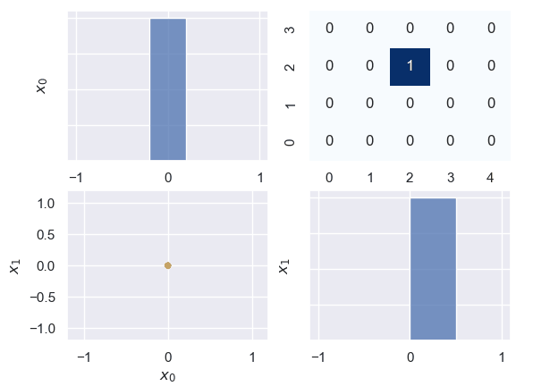

# HCXA
Histogram-based Count Maximization Algorithm.

HXCA is a online exploration tool that allows for choosing new reference state while taking previously visited states into account. HCXA discretizes the continuous state space and uses histograms as N-dimensional counter tables.As the continuous state space is approximated by its discrete counter part, the accuracy of this representation depends on resolution which in turn depends on the number of bins used in histogram to depict each dimension. Higher number of bins results in better resolution and finer approximation of the continuous space.By utilizing the Merge Sort algorithm, HCXA effectively explores the state-space, prioritizing regions that are underrepresented in the current sample set. This approach ensures a more balanced and accurate representation of the reference coverage function. The sorted list is then traversed in a first-in-first-out (FIFO) fashion and a validity check is performed.

# Example :1a
Initialize HCXA according to size of state space and desired resolution.
```python
import numpy as np
import seaborn as sns
from NDimCountMaximization import NCountMaximization
sns.set()

oracle = NCountMaximization(box_constraints=[[-1, 1],
                                             [-1, 1],
                                             ],
                            n_bins=[5, 4],
                            render_online=True,
                            render_options=dict(annot=False),
                            )
```
provide initial data point to add to coverage data matrix and then call `sample_optimally` to query new point.
```python
x = np.array([[0, 0],
              ])

num_points = 100
oracle.update_data(x)
for _ in range(num_points):
    point = oracle.sample_optimally()
    oracle.update_data(point)
oracle.render()
```

# Example : 1b
HCXA can be extended to higher dimensions just as easily
```python

oracle = NCountMaximization(box_constraints=[[-1, 1],
                                             [-1, 1],
                                             [-1, 1],
                                             [-1, 1],
                                             ],
                            n_bins=[5, 4, 3, 2],
                            render_online=False,
                            render_options=dict(annot=True),
                            )

x = np.array([[0, 0, 0, 0],
              ])

num_points = 100
oracle.update_data(x)
for _ in range(num_points):
    point = oracle.sample_optimally()
    oracle.update_data(point)

oracle.render()
```

```python
def reference_coverage(X):
    # for uniform distribution on a given shape the value range of the reference coverage is not important
    x0 = X[0]
    x1 = X[1]
    _sum = x0 ** 2 + x1 ** 2
    return np.less(_sum, 1)
```

```python
oracle = NCountMaximization(box_constraints=[[-1, 1],
                                             [-1, 1],
                                             ],
                            n_bins=[5, 4],
                            render_online=True,
                            reference_pdf=reference_coverage,
                            render_options=dict(annot=True),
                            )
```


